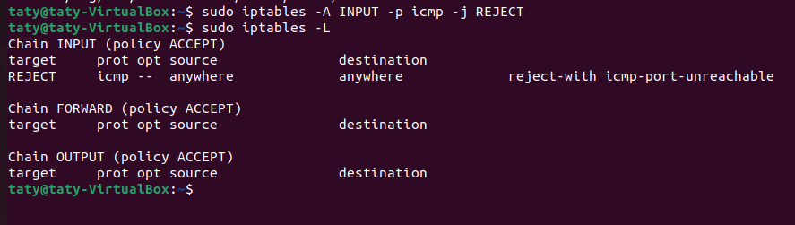
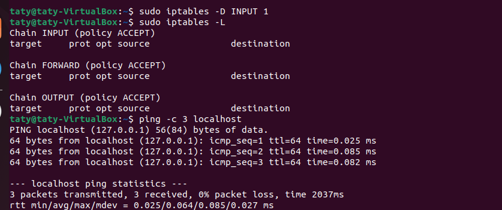

# 04_linux_You-shall-not-pass
адание "You shall not pass".

## Подключитесь к виртуальной машине по SSH и введите команду:

```bash
iptables -L
```

- [X] Напишите правило, которое будет запрещать входящие ICMP echo запросы к серверу. После чего заскриньте вывод цепочки так, чтобы новое правило попало в скриншот, а также в скриншотах должна быть команда, которую использовали.
- [X] Попробуйте попинговать виртуальную машину с хоста. (Пинговала с самой машины - речь ведь идёт о блокировке ВСЕГО трафика)
- [X] Сфотографируйте неудачную попытку пинга.
- [X] Верните исходные настройки iptables любым удобным способом и заскриньте вывод цепочки без вашего правила.

## УСЛОВИЯ РЕАЛИЗАЦИИ

В отчёте ментору приложите 3 снимка:

- [X] скриншот правила,



- [X] скриншот неудачной попытки соединения,


- [X] скриншот исходных настроек.


